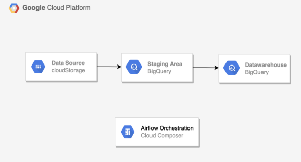
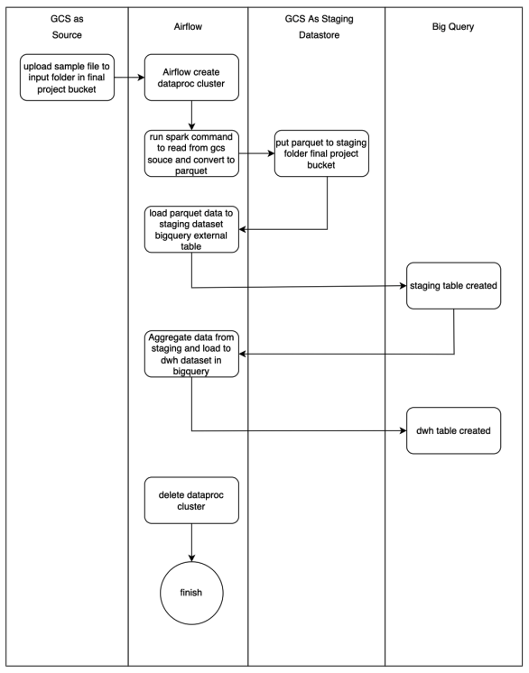

# Data Engineering Final Project

## Description

Dalam final project ini, anda akan membuat sebuah datawarehouse on the cloud menggunakan Apache airflow sebagai ETL Tools dan BigQuery sebagai on the cloud datawarehouse.

Project ini meliputi :
1. Bagaimana apache airflow membaca data dari csv
2. Load ke Raw / Staging Area menggunakan apache spark
3. Load ke BigQuery DWH menggunakan sql statement di bigquery yang di
orchestrate oleh airflow
4. ERD
5. Commit file and code kedalam github

## ETL Architecture

Berikut adalah arsitektur ETL sederhana untuk proyek ini.

## Project Flow Diagram

Berikut adalah diagram alir untuk proyek ini.

## Pre-requisites

Ada beberapa persyaratan sebelum mengimplementasikan proyek ini.
- Anda telah membuat Google Cloud Platform (GCP) Freetier
- Anda sudah familiar dengan alat Rekayasa Data, seperti Airflow, Spark, Kafka, dan banyak lagi...
- Anda memiliki beberapa pengalaman dalam Bahasa Pemrograman, terutama Python, SQL, Java; dan Dockerisasi
- Niat dan motivasi dalam menyerap ilmu baru di bidang Data Engineering
